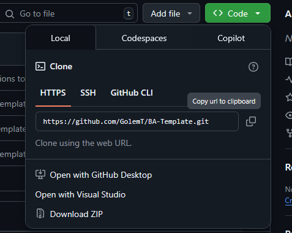

# BA-Template

Dieses GIT Repository enthält das [Typst](https://typst.app/) Template für die Ausarbeitungen an der [Berufsakademie Rhein-Main](https://studenten.ba-rm.de/).

## Aufteilung

Das Repository ist in 4 Teile aufgeteilt. Der Grund dafür sind die Vorlagen der BA, welche verschiedene Titelblätter hat.

## Setup

Um ein Typst Projekt mit dem Template aufzusetzten müssen die Dateien des Projektes in ein Typst Projekt hochgeladen werden. Derzeit ist das Template nicht über Typst direkt verfügbar.

### Das Repository clonen

Entweder mit git:

```bash
git clone https://github.com/GolemT/BA-Template.git
```

Oder manuell durch das herunterladen der ZIP auf [Github](https://github.com/GolemT/BA-Template):



### Neues Projekt in Typst anlegen

### Projektfiles auswählen

Für alle normale Semianrarbeiten der BA reicht das Template "Wissenschaftliches Arbeiten". Für Bacherlorarbeiten, Expose oder TPT III sollten die anderen Templates genutzt werden.

### Projektfiles hochladen

Alle Dateien im Ordner des Templates müssen hochgeladen werden. Dazu kann man im Typst Projekt über den "Hochladen" Knopf alle Dateien im Explorer auswählen.

### Main.typ ersetzen

Die main.typ welche mit der Erstellung eines neuen Projekts kommt kann gelöscht werden. Die FIles haben eine eigene main.typ welche das Template importiert und die benötigten settings bereits vorkonfiguriert hat.

## Schreiben in Typst

### Setzen der Hauptattribute

Jede Main.typ fängt mit einem definitionsblock des templates an. In diesem können Titel, authoren, abgabedatum, modul, Bild des Deckblatts definiert werden. Zudem kann hier durch einen Bool wert gesetzt werden, ob bestimmte Blöcke im PDF generiert werden sollen. So kann man z.B. das Codeverzeichnis ausblenden wenn man keinen Code in seiner Arbeit hat. Hier eine Übersicht der Attribute:

```
#show: project.with(
  // Folgende Einstellungen einkommentieren und anpassen wenn benötigt.

  // title: "",
  authors: (
    (name: "", Matrikelnummer: ""), 
    (name: "", Matrikelnummer: ""),
    (name: "", Matrikelnummer: ""),
    (name: "" Matrikelnummer: ""),
    (name: "", Matrikelnummer: "")
  ),
  // date: "01.01.2024",
  // logo: image("images/BA_Logo.jpg", width: auto),
  // modul: [Theorie-Praxis-Anwendung II],
  // sperrvermerk: false,
  // vorwort: false,
  // genderhinweis: true,
  // abbildungsverzeichnis: true,
  // tabellenverzeichnis: true,
  // codeverzeichnis: true
  // abkürzungsverzeichnis: true,
  // glossar: true,
  // literaturverzeichnis: true,
  
  // Texte
  // sperrvermerkText: [],
  // vorwortText: [],
  // genderhinweisText: [],
  
)
```

### Markdown ähnlich

Schreiben in Typst hat viele ähnlichkeiten mit Markdown und unterscheidet sich nur im Syntax. Für alle groben Textformatierungen oder SChreibstyle kann enweder die obere Leiste genutzt werden oder der Typst Syntax, welche in der [Dokumentation](https://typst.app/docs) beschrieben wird. Im allgemeinen wird empfohlen bei Fragen erst in der Doku nachzuschauen und im Anschluss in Foren wie dem [Typst Reddit](https://www.reddit.com/r/typst/) oder dem [Typst Forum](https://forum.typst.app/) nach Hilfe zu fragen. Die Main.typ die mit jeder Template mitkommt zeigt ein paar Grundfunktionen:

```typst
= Introduction

#include "/texts/subtext.typ"

== Different Objects

#acr("API") ist eine Abkürzung

#gls("API") ist eine Glossarverlinkung

#figure(
  image("images/BA_Logo.jpg", width: 100pt),
  caption: "Logo der Berufsakademie Rhein-Main"
)<Logo> //Hiermit wird ein aufrufbarer Link erstellt

#figure(
  table(columns: 2fr, row-gutter: 1)[Das ist eine Tabelle], 
  caption: "Tabellenbeispiel"
)<tabelle> //Hiermit wird ein aufrufbarer Link erstellt

#figure(
  caption: "Beispiel für Code",
  ```ts
    const ReactComponent = () => {
      return (
        <div>
          <h1>Hello World</h1>
        </div>
      );
    };

    export default ReactComponent;
  ```
)<code>

=== Contributions <Contribution>

#comment("This is a comment")

#todo("This is a ToDo")

#lorem(40)


= Linking Text

Hier wird nochmal #acr("API") aus dem Abkürzungsverzeichnis erwähnt.

Hier wird nochmal #gls("API") aus dem Glossar erwähnt

@Logo Zeigt das Logo der BA

@tabelle zeigt ein Beispiel einer Tabelle

@code zeigt ein Code Snippet

== Zitate

Hier ist ein Zitat @nissen_softwareagenten_2006.

#cite(<nissen_softwareagenten_2006>, form: "prose")) zitiert etwas im laufenden Text.

Hier ist ein zitat mit Link auf die Fußnote #footnote()[#cite(<nissen_softwareagenten_2006>)]
```

Diese Beispiele zeigen Grundlegenden Syntax in Typst. Überschriften werden wir in Markdown mit Symbolen angeführt, allerdings benutzt Typst =

```
= Heading 1
== Heading 2
=== Heading 3
etc...
``` 

Text wird normal ohne jegliche Änderungen geschrieben. Inhalte welche nicht Text sind oder andere Funktionalitäten haben sollen werden mit function calls geschrieben.

```
Das hier ist Text mit einem Zitat am ende #cite(@quelle).
```

So kann text grundlegend geschrieben werden und wird durch Typst automatisch formatiert.

### Grundlegende Funktions

Im folgenden werden die meist genutzten Funktionen erklärt.

#### cite

Die Zitierfunktion von Typst. Mit ihr können sämmtliche Quellen welche in der literatur.bib sind abgerufen und zitiert werden. Dafür müssen Quellen im bibTex format in die literatur.bib eingefügt werden.

Es gibt mehrere Arten zu zitieren:

```typst
#cite(@quelle)                            // Normales Zitat -> (Brooke, 1995)
#cite(@quelle, form: "prose")             // Zitat im laufenden Satz -> Brooke (1995)
#cite(@quelle, supplement: "vgl. S. 14)   // Zitat mit Seitenangabe -> (Brooke, 1995, vgl. S. 14)
```

Die Standard zitierweise ist Chicago. Es gibt viele Zitierarten zur auswahl welche im Template ausgewählt werden können. Suche dazu im template.typ die Zeile ```set cite(style: "chicaco-author-date")``` und ändere den Styl in einen von Typst akzetierten Styl um.

#### Verlinkungen

Um auf andere Textpassagen hinzuweisen und einen automatischen Link im generierten PDF zu erhalten kann man passagen verlinken:

```
Das ist Text in einem Abschnitt<abschnitt> // Erstellung des Links

Ich beziehe mich hier auf @abschnitt       // Nutzung des Links
```

In der generierten PDF wird das dann so aussehen:
```
Das ist Text in einem Abschnitt

Ich beziehe mich auf Abschnitt 2.2.2
```

#### Footnotes

Um Fußnoten einzufügen wird die Footnote Function mit dem folgenden Aufbau genutzt:

```
#footnote[content]                                       //Content beschreibt den Inhalt der Fußnote
#footnote[Diese These wird durch die Studie unterstützt] // Text als Fußnote
#footnote[#cite(@quelle)]                                // Zitat als Fußnote
```


#### Figures

Figures umschließen Bilder, Tabellen und Code Snippets. Sie werden gebraucht um die verschiedenen Verzeichnisse zu füllen. Der Grundlegende Aufbau ist wie folgt:

```
#figure(
    content,
    caption: "Unterschrift der Figure"
)
```

Content beschreibt hier Bilder, Tabellen oder Code. Inhalt welcher nicht den drei genannten Arten entspricht wird als Bild verstanden und somit ebenfalls gepflegt.

Hier finden sich Beispiele für die 3 Arten von Figure:

```
#figure(
  image("images/BA_Logo.jpg", width: 100pt),
  caption: "Logo der Berufsakademie Rhein-Main"
) // Beispiel für ein Bild

#figure(
  table(columns: 2fr, row-gutter: 1)[Das ist eine Tabelle], 
  caption: "Wichtige Tabelle"
) // Beispiel für eine Tabelle

#figure(
  ```ts
    const ReactComponent = () => {
      return (
        <div>
          <h1>Hello World</h1>
        </div>
      );
    };

    export default ReactComponent;
  ```,
    caption: "Basis Code",
) // Beispiel für ein Code Snippet
```

#### acr und gls

Durch die zwei Dateien acronyms.typ und glossary.typ werden Abkürzungsverzeichnis und Glossar geführt. Wenn ein Element in einer dieser beiden Dateien angelegt ist kann es im Text erwähnt werden. So wird automatisch ein Link erstellt welcher den Leser zum jeweiligen Verzeichnis führt.

```
#acr("API")     // Link zum Abkürzungsverzeichnis
#gls("Website") //Link zum Glossar
```

Wenn Abkürzungen zum ersten Mal erwähnt werden werden sie automatisch mit der vollen ausschreibweise eingefügt:

```
#acr("MD") -> Markdown (MD)
#acr("MD") -> MD
```

#### Linebreak und Pagebreak

Falls die Formatierung des Templates erweitert werden soll (durch leerzeilen oder Seitenumbrüche) können diese durch functions eingebaut werden:

```
#linebreak()  // Fügt einen Zeilenumbruch ein
#pagebreak()  // Fügt einen Seitenumbruch ein
```

## Weitere Functions

In diesem Dokument wurden nur die Grundarten von Functions angerissen. Es gibt viele weitere und um einiges mehr an parametern welche man den Functions übergeben kann. Für mehr eignet sich die [Dokumentation](https://typst.app/docs).
